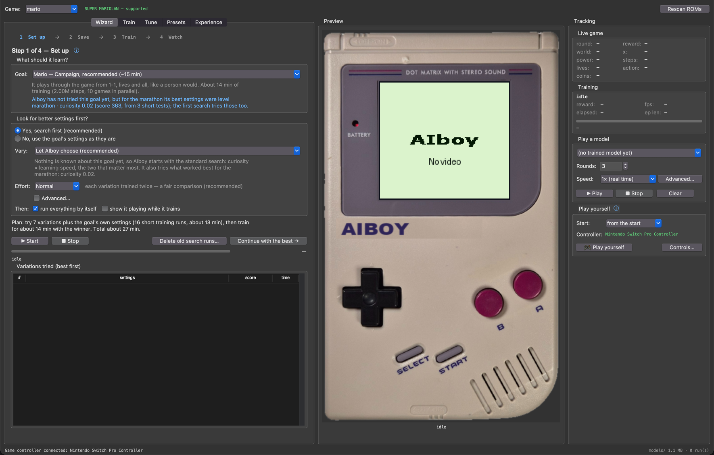
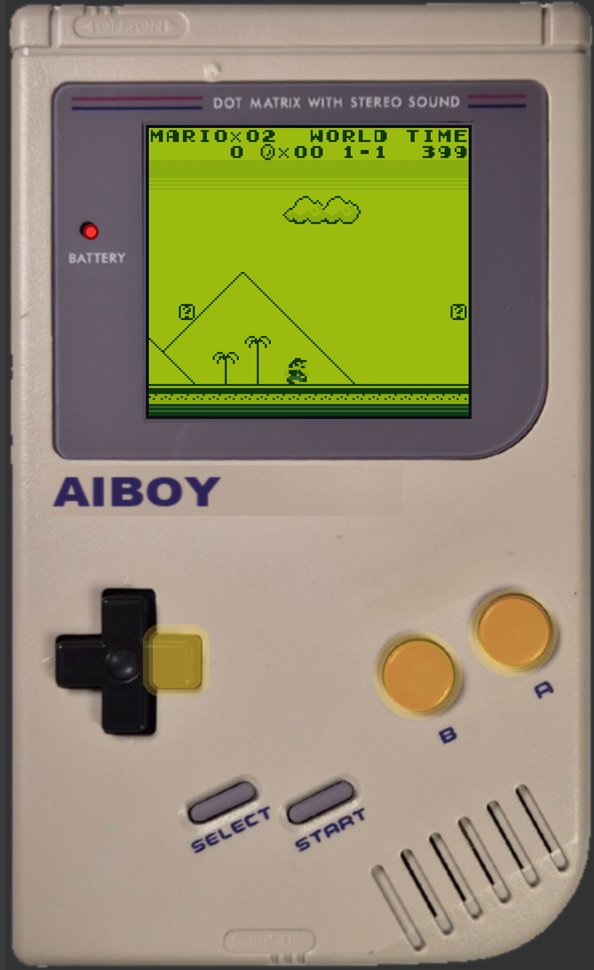

# AIboy

**Teach an AI to play Super Mario Land on a Game Boy, and watch it learn from every try.**

AIboy trains a reinforcement-learning agent on an emulated Game Boy and shows
it playing on one. [PyBoy](https://github.com/Baekalfen/PyBoy) is the emulator,
[Stable-Baselines3](https://stable-baselines3.readthedocs.io/) PPO is the
learner, and a desktop app wraps the whole workflow in plain language.



- **A wizard does the work.** Pick a goal, press Start, come back to a playing
  agent. No knowledge of PPO needed.
- **AIboy remembers.** Every test and training run goes into its experience
  file. Searches skip what is known, explore around the best, borrow from
  related goals, and improve the presets themselves.
- **A Game Boy on screen.** The emulator plays on the LCD of a Game Boy
  picture, the buttons light up as the agent presses them, and the live
  numbers sit next to it.
- **Expert tabs for everything else.** Training runs with their evaluations
  and messages, sweeps with a best-first table, presets, and the complete
  experience.
- **Command line and a one-command build** for scripts, remote machines and a
  standalone app.

Two games can be trained in this version: Super Mario Land and Kirby's
Dream Land (see [Roadmap](#roadmap) for the rest). Any ROM that boots can
be played by hand.

---

## Contents

1. [Install](#install)
2. [Quick start](#quick-start)
3. [The window](#the-window)
4. [How AIboy learns](#how-aiboy-learns)
5. [The tabs in detail](#the-tabs-in-detail)
6. [Command line](#command-line)
7. [How it works](#how-it-works)
8. [Build your own app](#build-your-own-app)
9. [Project layout](#project-layout)
10. [Tests](#tests)
11. [Troubleshooting](#troubleshooting)
12. [Roadmap](#roadmap)

---

## Install

Requirements: Python 3.10–3.12 (3.11 is what AIboy is developed with),
macOS / Linux / Windows, no GPU. The window needs a display of at least
1700 × 960; on a larger one the Game Boy grows (up to 1770 × 1130 with the
emulator at 2×). The app follows the system appearance, light or dark.

The tested setup is a conda environment from conda-forge (Python 3.11 with
its Tk 8.6.13; every library comes from pip through `requirements.txt`):

```bash
git clone <this repo> aiboy && cd aiboy
conda env create -f environment.yml
conda activate aiboy
```

Without conda, a virtual environment works too; use a Python whose
Tkinter has Tk 8.6 (`python -m tkinter` shows the version):

```bash
python -m venv .venv && source .venv/bin/activate      # Windows: .venv\Scripts\activate
pip install -r requirements.txt
```

`requirements.txt` pins the major versions AIboy is written for: PyBoy 1.6
(PyBoy 2 changed its API), NumPy 1 (PyBoy's wheels are built against it),
Gymnasium 0.29 with Stable-Baselines3 2.2–2.3, PyTorch 2.

Put your ROM at **`ROMs/mario.gb`**. ROMs are copyrighted and not included:
you must own the game and dump the cartridge yourself. The file must be the
original *Super Mario Land* (cartridge title `SUPER MARIOLAN`).

```bash
python main.py
```

Prefer a double-clickable app without Python? See
[Build your own app](#build-your-own-app).

## Quick start

The window opens on the **Wizard** tab. Four steps, one Start button.

| Step | What happens |
|------|--------------|
| **1 Set up** | Choose a **goal** (a preset such as `Campaign, recommended`). Decide whether AIboy should **look for better settings first**. The **Plan** line says what will happen and how long it takes. Press **▶ Start**. |
| **2 Save** | The settings that won are shown, tuned values highlighted. Give them a name or continue without saving. |
| **3 Train** | The real training run. Progress, score, speed and ETA update live under Tracking. **Stop** ends early and keeps the best model. |
| **4 Watch** | The agent plays on the Game Boy with the exact settings it was trained with. |

With **run everything by itself** ticked (the default) the wizard chains
search → save → train → watch without further clicks.

Under *Set up*, **Let AIboy choose** is the default way to vary settings: the
first time it runs a standard search, later it scores known variations from
memory and explores untested ones around the best it has found. **Effort**
(Quick / Normal / Thorough) sets how often and how long each variation is
trained. Rest the pointer on any control for its explanation.

### Running overnight

1. Goal `Mario — Marathon, overnight (~8 h)`, keep *Yes* and *Let AIboy
   choose*, leave **run everything by itself** ticked, press **Start**.
   Expect up to 1.5 h of search the first time (less on later nights,
   because AIboy skips what it knows), then the 60 M-step training. The ETA
   is under Tracking. For a goal this long the search never tries less
   curiosity than the goal's own (such variations get the goal's curiosity
   instead): short tests reward greed, and an overnight run tuned that way
   once stood at the gap in 1-2 all night.
2. On a Mac the app prevents idle sleep while training or tuning runs
   (`caffeinate`); the display may still turn off. Do not close the lid.
3. In the morning the wizard is on **Watch** and the agent is playing. If you
   restart the app instead, pick the run in the model list under Tracking
   and click **▶ Play**. A marathon is played the way it was trained: one
   life from 1-1.

### How long does it take?

Rough numbers on an Apple M1 Max with tile observations and 10 parallel
emulators (about 3 000–3 500 steps/s). After the first runs the app shows
estimates measured on your own computer instead.

| Steps     | What you get                                          | Time    |
|-----------|-------------------------------------------------------|---------|
| 20 k      | learns "run right"; dies at the first enemy           | seconds |
| 150–300 k | jumps some obstacles                                  | ~2 min  |
| 2 M       | `Campaign, recommended`; usually clears 1-1           | ~12 min |
| 8–10 M    | `extended` / `Random levels`; into world 2–3          | ~1 h    |
| 60 M      | `overnight` presets                                   | ~8 h    |

Search trials of 100 k steps (the default) separate good from bad settings
on the campaign; use 500 k+ for random / sequential sweeps.

## The window

Three sections, always visible: **workflow tabs** on the left, the **Game
Boy** in the middle, **Tracking** on the right. Every explanation is a hover
away: rest the pointer on a field, a checkbox or a ⓘ.



**Preview.** A Game Boy with the emulator's picture on its LCD, in the
pale green of its idle screen behind an even dark rim. Whatever
produces something to watch shows here without switching tabs: a finished
model, the live preview of a training run, the wizard's Watch step, your
own game. The D-pad, A and B light up with every button
pressed, hovering a button tells what it does (and which key it is), and
the ON light is lit while the boot video, a playback or the live preview
runs. Under the device a status line says what is playing and how each
round ended. **Sound**, in the panel's header, plays the game's own sound
while you play yourself or an agent plays at real speed (1×); faster or
slower playback and the training preview stay silent, since the sound
cannot follow them. It is off until you tick it and then remembered; the
boot video's jingle plays regardless.

The device is a pair of pictures, `assets/interface/aiboy_off.png` and
`aiboy_on.png` (the same picture with the ON light off and on, transparent
around the case). It is scaled so the 160 × 144 frame sits on the LCD at 2×
when the display has room for the window, else 1.75× or 1.5×. At start-up
the screen plays the boot video from `assets/` with its sound
(`AIBOY_NO_INTRO=1` starts silently; `python tools/build_intro.py` makes the
frames from `assets/gb_intro.mp4`, ffmpeg needed).

The pictures and the boot video in the repository are AIboy's own design and
carry no maker's marks (`tools/make_interface.py` brings new pictures to the
size the GUI measures them in, `tools/make_intro.py` makes the video). If you
own the real thing, put it into the `assets/` folder as
`interface/gameboy_off.png` and `interface/gameboy_on.png` (the device),
`orig_gb_intro.npz` and `orig_gb_intro.wav` (the video) and AIboy uses it
instead. In the source tree that is the repository's `assets/`; for a built
app it is the `assets/` folder next to the app (the shipped files stay inside
the bundle). Those files are ignored by git and left out of release builds
(`aiboy/paths.py` lists the pairs); `AIBOY_SHIPPED_ASSETS=1` ignores them
for one start.

**Tracking.** The panel follows what the app is doing. Its first line
names the activity, and only the boxes that matter for it are shown:

- *Nothing running*: **Watch an agent** and **Play yourself**, the two
  things you can start from here.
- *Training* (from the Train tab or the wizard): the run's name and state,
  the progress bar with the ETA, the average score and round length of the
  last 100 training rounds, speed, elapsed time, how many evaluations were
  made, the last and the best evaluation score, and a **Stop** button. With
  *Live preview while training* the live game and its finished rounds show
  above it. The box stays, with the final numbers, until something else
  starts.
- *Searching* (a wizard search or a Tune sweep): which trial is running and
  how many are already known, the settings being tried, progress and ETA,
  the trial's steps, score and speed, the best variation so far, and
  **Stop**.
- *Agent playing*: **Live game** (round, world, power-up, lives, coins,
  score, position, steps and what it is pressing), a **Rounds** table with
  every finished round (score, steps, how it ended), and the
  **Watch an agent** box with **■ Stop** and **Clear**.
- *You play*: the live game shows what matters to a person, the level,
  power-up, lives, coins, score, position, the game's clock and what you
  are pressing, plus the **Play yourself** box, whose button now stops the
  game. **Show what an agent would see** adds the table of numbers an agent
  gets for the game you are playing, a way to check what the agent can and
  cannot tell apart at any spot.

Rest the pointer on any number for what it means. The status bar at the
bottom repeats the activity in one line.

- *Watch an agent*: every saved model of the game (best and final model of
  each run, plus snapshots), rounds to play, speed from 0.5× to unlimited,
  **▶ Play**, **■ Stop**, **Clear**. Selecting a model applies the
  observation settings recorded in its `run.json`; **Advanced…** opens the
  step cap, random actions and the observation setup for older runs.
- *Play yourself*: the plain game on the Game Boy, at real speed, with the
  keyboard, the mouse or a game controller. **Start** boots the game normally
  (title screen, press START) or drops you straight into a level of Super
  Mario Land; **🎮 Play yourself** starts, the same button stops. Standard
  keys: arrows or W A S D move, X (or K, space) is A, Z (or J) is B, Enter
  is START, Shift is SELECT; the buttons on the picture can be clicked. A
  controller connected by USB or Bluetooth is picked up while the app runs
  and shown next to *Controller* (a Switch Pro, Xbox or PlayStation pad, or
  anything else SDL2 knows); every connected controller plays, so it does
  not matter which one the system lists first. As standard the D-pad or
  left stick move, A / X = A, B / Y = B, + = START, − = SELECT.
  **Controls…** changes all of this: click a cell, press the key or the
  controller button you want (right-click adds a second one or clears), and
  it is saved in `settings.json` under `controls` for next time. The window
  names the buttons the way your controller does (a PlayStation ✕, a Switch
  −), and while nothing is being bound its status line shows what is pressed
  on the controller right now and what that does on the Game Boy — the
  quickest way to see whether the app hears the pad at all (hovering
  *Controller* shows the same). Without the app, `python main.py
  controller-test` prints the same for 20 seconds. Any ROM that boots can be
  played, not only Super Mario Land.

Speed is paced per emulator frame, so real time is real time even though a
jump holds the button for 10 frames and a walk step for 4.

**Tabs.** *Wizard* is the guided path. *Train* runs one training with the
full log. *Tune* runs sweeps. *Presets* manages configurations.
*Experience* shows everything AIboy has learned. Details in
[The tabs in detail](#the-tabs-in-detail). The **Game** selector at the top
lists every ROM in `ROMs/` (`.gb` and `.gbc`) and says what AIboy can do
with it: green, supported — train it and play it; amber, play it yourself
only (PyBoy has no environment for it here; with a wrapper the CLI can
still train a pixel agent); red, the ROM does not boot. AIboy is an
emulator for every game and a trainer for the supported ones. The status
bar at the bottom always says what is running.

## How AIboy learns

Every `train` process (a wizard trial, a Tune trial, a Train-tab run, a CLI
run) appends one line to **`experience.jsonl`** when it ends: the complete
configuration, the evaluation history, the wall-clock duration, who started
it and whether it finished. The file lives next to the user's other data and
can be read with any text editor.

From those records AIboy answers six questions.

| Question | Answer |
|----------|--------|
| **Do I already know this?** | Two records are the same experiment when every outcome-deciding field matches (game, observation type, level mode, action timing, attempt limits, trial length, emulators, PPO settings, seed). A planned trial that matches is scored from the record instead of trained; the results table marks it *known*. Unfinished runs are remembered but never reused. |
| **What worked best for this goal?** | Trials are compared within a *task*: same game, observation type, level mode, attempt limits and trial length. Seeds of the same settings are averaged. |
| **What should I try next?** | *Let AIboy choose* runs the standard search until at least half of it is known, then proposes untested single-step changes around the best known settings (learning rate and curiosity ×/÷ 2, rollout and batch ×/÷ 2, epochs, gamma, clip and GAE lambda one rung up or down). The best known settings always take part, so the winner is the best of old and new. For a goal of 10 M steps or more a variation with less curiosity than the goal's own is tried with the goal's curiosity instead: short tests cannot judge exploration. |
| **What do goals have in common?** | Goals that share the game, observation type and action timing are *related*. For a goal never tested, AIboy *borrows*: it says what worked for the related goal and tries those settings first. Nothing borrowed is applied without a test. |
| **Which presets can be improved?** | After every search and training, each preset's own settings are compared with the best tested settings for its goal. A clear win (the preset's own settings were tested, the challenger leads by more than the seed spread and by at least 5 %) is applied: built-ins get a resettable override, user presets are updated, and an *improved* record with the evidence is kept. The curiosity of a long-run preset (10 M steps or more) is never lowered this way. **Improve presets automatically** on the Experience tab turns this off; **Improve presets now** applies it on demand. |
| **How fast is this computer?** | The median steps per second of recent runs with the same setup replaces the built-in guess in every estimate ("measured speed"). |

Scores are only comparable while the game logic stays the same, so every
record carries `ENV_VERSION` (`aiboy/games.py`). Change the reward, the
observation or the level modes, bump the constant, and older records are
kept but never reused.

## The tabs in detail

### Train

Pick a **preset** or edit the fields (**Basic**, **PPO**, **Input &
cadence**; each field explains itself on hover), type a **run name** (blank
= `default`; pick an existing run to continue it) and **Start training**.
The trainer is a subprocess, so the window stays responsive. Its numbers
update under Tracking; below the fields the tab keeps what the trainer
reports about this run, read out of its output: an **Evaluations** table
(after how many steps each evaluation was made, its score and length, and
which ones set a new record, when the best model is saved) and a
**Messages** box with the trainer's notes, warnings and errors, finished
playback rounds and preset improvements. The stats tables the trainer
prints every few seconds are left out; **Full log…** opens the complete raw
output in its own window for troubleshooting.

- **Resume if possible** (ticked by default) continues the named run when it
  has a checkpoint and starts fresh otherwise, so a reused name never
  overwrites a trained model by accident. When a run is continued the saved
  model's architecture, `n_steps`, `batch_size` and observation settings are
  kept; `ent_coef`, `learning_rate` and `n_epochs` come from the fields. The
  continued run trains the *Timesteps* of the form on top of what it has,
  keeps its earlier evaluations, and only replaces `best_model.zip` with a
  score above the best it had reached. The hint under the run name says
  which will happen.
- **Exploration guard.** A long run can collapse: the agent settles on one
  fixed way of playing, every attempt ends the same way (same steps, same
  score) far below its best evaluation, and since nothing varies any more
  nothing can be learned. The trainer looks at the finished attempts after
  every rollout; when for three rollouts in a row the last 20 attempts are
  identical (same steps, same score) and are not a mastered task (they do
  not finish the level or the marathon, or score below the best
  evaluation), it restores `best_model.zip`, raises `ent_coef` (×4, at
  least 0.02) and
  says so in *Messages*. This happens at most three times per run, then
  the run stops. Continuing a collapsed run repairs it within its first
  three rollouts. The policy's entropy is recorded in TensorBoard
  (`train/policy_entropy`) but does not decide: a collapsed Mario policy
  can keep a healthy-looking entropy by mixing JUMP and UP+JUMP, which are
  the same move in a walking level. An update is also cut short once it
  moves the policy further than a KL of 0.03, which is what usually starts
  a collapse.
- A **modified** marker appears under the preset selector as soon as a field
  differs from the preset.
- **Live preview while training** plays each new `best_model.zip` on the
  Game Boy as it is saved, at training speed (unthrottled, like the trainer;
  the play modes run at real time). It costs some training fps. When a run
  ends its best model is selected under Tracking.
- **Stop** (on the tab or under Tracking) interrupts the trainer: it saves
  `checkpoints/final.zip` and exits. `logs/best_model.zip` is always kept.
- **TensorBoard** serves `models/mario/` on port 6006 with the TensorBoard the
  app was installed or built with (the built app needs nothing extra). **Save as…** stores
  the fields as a preset; **Manage…** opens the Presets tab.

While training or tuning runs, every input on every tab is locked.

### Tune

Every trial is a `main.py train` subprocess of *Steps / trial* steps, scored
from its evaluation history. Trials are named `<prefix>-<config>[-s<seed>]`.

- **Base preset**: the config every trial starts from; the sweep overrides
  only the listed fields. **Include the base preset as candidate 1** (default
  on) means a sweep can only win by beating what you already had.
- **Sweep**: a template with a one-line rationale, or hand-edited JSON. Two
  forms: a grid `{"param": [values, …]}` and a candidate list `[{"param":
  value, …}, …]`. **Suggest from experience** fills in untested variations
  around the best known settings.
- **Grid or Random**: every combination, or N distinct draws (seeded from
  the sweep text, so a sweep repeats exactly).
- **Seeds / config**: with 2–3 seeds the table shows `mean ± std`.
- **Metric**: *late eval reward* (the last third of the evaluations; the
  wizard's choice), best, final or mean evaluation reward, or *reward per
  compute-minute*. Switching re-ranks the table from the stored histories.
- **Reuse known results** scores matching trials from the experience
  instead of training them, which also resumes an interrupted sweep.
- **Keep best N trial runs** deletes the run folders outside the best N as
  the sweep goes; their scores stay.

Results are saved to `models/mario/_tune/<prefix>.json` after every config
(**Load results…** reopens them). **Save as preset…** and **Load into Train
tab** promote a row. The winner rule: the best candidate replaces the base
preset only if it leads by more than the seed spread and by at least 5 %.

### Presets

Every preset in one table, the selected one in the same form as the Train
tab. **Built-in** presets keep their shipped values behind your edits
(**Reset to default** brings them back); **user** presets can be renamed and
deleted. **New…**, **New from Train tab…** and **Duplicate…** create
presets; double-click (or **Load into Train tab**) trains with one; **Use in
Wizard** makes it the goal. User presets live in `training_presets.json`,
built-ins in `builtin_presets.json`.

### Experience

Every record of the selected game, newest first: tests, training runs and
preset improvements, with settings, steps, score, speed and duration. For
the selected row, **What AIboy concluded** shows the best known settings of
its task and, per knob, the mean score of every value tried. **Load into
Train tab** and **Save as preset…** reuse a row; **Forget selected…** and
**Forget all…** delete records (models, presets and run folders are never
touched).

### Disk space

- A run keeps its newest 5 step snapshots while it trains and drops them
  when it finishes (`final.zip` holds the last state). **Compact…** applies
  the rule to older runs.
- Tuning trials keep only `logs/`; sweeps keep only the best N run folders.
- **Continue with the best** and the automatic wizard run delete the search
  runs, because the saved preset and the experience carry everything.
- **Delete trial runs…** (Tune), **Delete old search runs…** (Wizard) and
  **Delete…** (Train) remove runs after asking; presets and the experience
  are never touched. The status bar shows the size of `models/`.

## Command line

```bash
python main.py train --n-envs 10 --timesteps 2000000 --run-name campaign1
python main.py play  --run-name campaign1 --episodes 3          # SDL2 window
python main.py gui
```

Paths are relative to the project directory wherever you run the command
from. Every `train` is recorded in `experience.jsonl` when it ends.

### `train` flags

| Flag                 | Default | Notes                                                             |
|----------------------|---------|-------------------------------------------------------------------|
| `--game`             | mario   | `mario` or `kirby` (the games with an AIboy environment)          |
| `--obs-type`         | tiles   | `tiles` (fast MLP) or `pixels` (CNN, ~40× slower)                 |
| `--start-level`      | default | `default` / `random` / `sequential` / `marathon` / `W-L`          |
| `--n-envs`           | cores   | Parallel emulators, one per core (max 12), clamped to cores        |
| `--timesteps`        | 500000  | Total env steps                                                   |
| `--action-repeat`    | 4       | Frames each action is held                                        |
| `--frame-stack`      | 4       | Consecutive observations stacked as input                         |
| `--device`           | cpu     | `cpu` (recommended for tiles), `cuda`, `mps`, `auto`              |
| `--resume`           | off     | Continue from the newest checkpoint of the run if there is one    |
| `--run-name`         | default | Sub-directory under `models/mario/`                               |
| `--source`           | cli     | `cli` / `train` / `tune` / `wizard`: recorded in the experience   |
| `--checkpoint-freq`  | 25000   | Env steps between checkpoints                                     |
| `--keep-checkpoints` | 5       | Newest step snapshots kept per run (0 = all)                      |
| `--eval-freq`        | 10000   | Env steps between evaluations                                     |
| `--n-eval-episodes`  | 3       | Mario evals are deterministic; 1 episode is run                   |
| `--time-budget`      | 250     | Timer units (of 400) an attempt may use; 0 = whole timer          |
| `--stall-steps`      | 300     | Steps without a new furthest point before the attempt ends; 0 = off |
| `--learning-rate`    | 2.5e-4  |                                                                   |
| `--n-steps`          | 256     | PPO rollout length per env                                        |
| `--batch-size`       | 128     | Shipped presets use 256                                           |
| `--n-epochs`         | 4       |                                                                   |
| `--ent-coef`         | 0.01    | Entropy coefficient (raise for more exploration)                  |
| `--gamma`            | 0.99    | Discount factor                                                   |
| `--gae-lambda`       | 0.95    | GAE lambda                                                        |
| `--clip-range`       | 0.2     | PPO clip range                                                    |
| `--seed`             | 0       |                                                                   |

### `play` flags

| Flag                | Default | Notes                                        |
|---------------------|---------|----------------------------------------------|
| `--model`           | auto    | Explicit path to a model `.zip`              |
| `--run-name`        | default | Resolves best → final → newest snapshot      |
| `--episodes`        | 3       |                                              |
| `--start-level`     | default | Same options as `train`                      |
| `--emulation-speed` | 1       | 1 = real time, 2 = 2×, 0 = unlimited         |
| `--stochastic`      | off     | Sample from the policy instead of argmax     |
| `--max-steps`       | 0       | Cap steps per episode (0 = none)             |

`--obs-type`, `--action-repeat` and `--frame-stack` must match the values
the model was trained with.

## How it works

### The game environments

`aiboy/env.py` holds one base class and one environment per game:

- **`GameBoyEnv`**, the base every game builds on: held-button actions,
  pixel or tile observations, the frame loop (the GUI's per-frame callback
  paints and paces there), start / reset through PyBoy's game wrapper, and
  the furthest-point tracker behind the stall rule. A game adds its action
  table, its tile grid and its reward, nothing else.
- **`MarioEnv`** for Super Mario Land (below) and **`KirbyEnv`** for
  Kirby's Dream Land. `ENV_CLASSES` maps a game to its class; a ROM
  without one still runs through PyBoy's generic env from the command
  line (pixels only, no shaping).

**Kirby's Dream Land** has no position counter, so progress is the
screen's scroll to the right (accumulated, with the 256-pixel wrap
unwound) plus Kirby's own place on the screen (RAM `D05C`). Eleven actions:
NOOP, RIGHT, LEFT, JUMP, RIGHT+JUMP, LEFT+JUMP, INHALE, RIGHT+INHALE,
LEFT+INHALE, UP, DOWN. Reward per step: `1 × new progress` `+ 0.05 × score
gained` `− 50` per point of health lost `− 0.03`; a death is `− 500` and
ends the attempt, which always starts at the beginning of the game. The
game has no timer, so the *time budget* does nothing for Kirby; the Kirby
presets set a **stall limit** of 400 steps instead, and a hard cap of 6 000
steps per attempt makes sure an evaluation always ends. Tiles: PyBoy's
`game_area()` scaled into [0, 1], with health, lives and progress in the
first three cells.

**Super Mario Land** (`MarioEnv`):

- **Held-button actions.** Buttons stay pressed for the whole
  `action_repeat` window; jump actions hold A for extra frames so Mario
  reaches full height. Thirteen actions: NOOP, RIGHT, LEFT, JUMP, RIGHT+JUMP,
  RIGHT+RUN, RIGHT+RUN+JUMP, LEFT+JUMP, LEFT+RUN, LEFT+RUN+JUMP, DOWN, UP,
  UP+JUMP. The two UP actions are for the submarine (2-3) and the plane
  (4-3), which rise with UP and fire with A or B. A model trained before
  them (eleven actions) still plays, and a resumed run gets the two new
  outputs added.
- **Observations.** `tiles` (default): a 16 × 20 semantic grid (−1 Mario,
  0 empty, .5 ground / pipe / lift, .6 block, .8 coin, .85 item, 1 enemy,
  bomb or projectile) with seven normalised scalars in the top-left cells:
  lives, coins, timer, x, world, level and Mario's power-up (read from RAM
  at `FF99` / `FFB5`). Trained with an MLP, about 10× faster than pixels on
  CPU. `pixels`: the raw 144 × 160 screen with a CNN. The score is not
  observed: it only grows and nothing depends on it. The grid is built from
  PyBoy's tile lists plus corrections measured in the game
  (`tools/mario_tile_survey.py`, also `--sprites`): decoration PyBoy files
  as a block reads empty, and the enemies, bombs and projectiles PyBoy's
  lists miss read as hazards. Under Tracking, **Show what the agent sees**
  displays this grid as a table of numbers while an agent plays, and while
  you play yourself (the grid an agent would get for your game).
- **Reward per step.** `3 × new forward distance` (backtracking cannot
  farm) `+ 5 × coins` `+ 0.05 × score gained` `− 0.03` per step. A death is
  `− 500`, a level clear `+ 1000` (`+ 3000` more for finishing a marathon).
  The score term pays 5 per enemy, 5 extra per coin, 50 for a mushroom or
  flower, and 5 per unit of the level-end timer countdown.
- **Instant events.** The game-state byte at `0xFFB3` credits a clear the
  step Mario touches the goal and a death the step he dies, so no samples
  are wasted in cutscenes.
- **Time per attempt.** A level has 400 timer units (about 4 min 18 s). An
  attempt may use a **time budget** of 250 (about 2 min 42 s, ≈ 2 400
  steps), and a **stall limit** of 300 steps without a new furthest x (at
  least 20 s of game time; 0 turns it off). Reaching either ends the attempt
  the way a death does: the same `− 500`, the episode over. In the real game
  the timer running out kills Mario; and while standing still was free, a
  long marathon run learned to stand at the gap in 1-2 rather than risk the
  jump, and its evaluations scored the standing above the trying.

Any change here changes what a score means: bump the game's entry in
`ENV_VERSIONS` in `aiboy/games.py`.

### Level modes

| Mode         | Episode ends on                       | Use it for                           |
|--------------|---------------------------------------|--------------------------------------|
| `default`    | game over (all lives lost)            | playing through the game (campaign)  |
| `random`     | any death or clear; new random level  | generalising across every level      |
| `sequential` | any death or clear; retry on death    | beating levels in order              |
| `marathon`   | any death, or clearing the last level | all levels in one life               |
| `W-L`        | any death or clear                    | drilling one level                   |

Levels other than 1-1 start from cached save-states in
`models/mario/_level_states/`, created on first use. All twelve levels are
in, including the two vehicle levels 2-3 (submarine) and 4-3 (plane, ending
with Tatanga), which the game runs in its auto-scroll state.

**A marathon is one continuous run from 1-1.** The moment Mario touches the
goal the next level's save-state is loaded and play continues in the same
life. The episode ends at the first death, when the time budget is used up
or Mario stops getting further (both count as a death), or after 4-3 (with
a large bonus). Training, evaluation and playback all
play exactly this marathon, so a training reward, an evaluation score and
what you watch mean the same thing. Completing all twelve levels in one
life is a long project: `Marathon, all levels (~1 h)` is a start, the
`overnight` preset is realistic. Because every attempt starts at 1-1, a
later level is only practised after everything before it was cleared in
that same life; a `sequential` run learns the later levels faster and can
be watched as a marathon afterwards.

Evaluation during training mirrors the mode where that terminates cleanly
(fixed level, marathon) and uses the campaign otherwise (random,
sequential), so eval rewards stay comparable.

### Training and performance

PPO from Stable-Baselines3 with `MlpPolicy` (two 256-unit layers) for tiles
or `CnnPolicy` for pixels, over a `SubprocVecEnv` of `n_envs` emulators with
`VecFrameStack`. Checkpoints and the best model come from callbacks; the
trainer appends its experience record when the run ends. On Apple Silicon
CPU beats MPS by about 4× for the tile MLP, so `--device cpu` is the
default.

One rollout of 10 envs × 512 steps on an M1 Max, measured:

| Phase                         | Time    | Notes                                              |
|-------------------------------|---------|----------------------------------------------------|
| emulation + inference         | ~1.1 s  | 80 % is PyBoy itself                               |
| PPO update, batch 128         | 0.83 s  | emulator processes idle meanwhile                  |
| PPO update, batch 256         | 0.49 s  | shipped default                                    |
| PPO update, batch 512         | 0.33 s  |                                                    |
| evaluation (every 25 k steps) | ~0.35 s | 1 episode; more would replay the identical episode |

Hence: batch size 256 in every shipped preset, one deterministic eval
episode, emulators = cores (max 12), Torch single-threaded for the tile
MLP, and tiles rather than pixels unless tiles plateau. Until AIboy has
measured your computer, expect roughly `350 × cores` steps/s for tiles.

### Files AIboy keeps

```
experience.jsonl              everything AIboy has learned and changed (one JSON record per line)
training_presets.json         your presets and overrides of built-ins (incl. AIboy's improvements)
settings.json                 the few app settings
models/mario/
├── _level_states/            per-level save-states (cache)
├── _tune/<prefix>.json       sweep results (Tune tab, wizard)
└── <run-name>/
    ├── checkpoints/ppo_<N>_steps.zip   periodic snapshots (newest 5 kept)
    ├── checkpoints/final.zip           saved when the run ends or is stopped
    ├── logs/best_model.zip             best evaluation reward
    ├── logs/evaluations.npz            eval history
    ├── tensorboard/                    TensorBoard events
    └── run.json                        training settings (playback reads it)
```

One experience record:

```json
{"kind": "trial", "config": {"game": "mario", "start_level": "default", "timesteps": 100000,
 "ent_coef": 0.03, "learning_rate": 0.0003, "seed": 0, "...": "..."},
 "evals": [[20000, 45.2, 310.0], [40000, 190.7, 520.0], [100000, 850.1, 900.0]],
 "duration": 41.8, "complete": true, "source": "wizard", "run_name": "wizard-003",
 "resumed": false, "env_version": "mario-1", "created_at": 1789700000.0, "id": "3f9c2a1b7d4e"}
```

`models/`, `ROMs/`, `training_presets.json`, `settings.json` and
`experience.jsonl` are git-ignored. To move your knowledge to another
computer, copy `experience.jsonl` next to the app there.

## Build your own app

`build_release.py` packages AIboy with PyInstaller for the computer it runs
on, so the result runs without Python:

```bash
python build_release.py            # -> release/AIboy/ and release/AIboy-<platform>.zip
python build_release.py --no-roms  # leave the ROMs folder empty (for handing the build on)
python build_release.py --no-selftest --no-zip
```

The script installs PyInstaller if needed, profiles the machine (cores,
memory, chip; the release's number of parallel emulators comes from this),
runs PyInstaller (a windowed `AIboy.app` on macOS, ad-hoc signed; an `AIboy`
folder with an executable on Windows and Linux), assembles `release/AIboy/`
with a `ROMs/` folder and a `README.txt`, and runs the built app once to
prove that process spawning works.

The user's files (ROMs, models, presets, `experience.jsonl`,
`gui_errors.log`) live next to the app, never inside it, so replacing the
app with a newer build keeps everything. A build is for one platform and
CPU type.

## Project layout

```
main.py                 Entry point: python main.py [gui | train | play]
build_release.py        Packages a standalone app for this machine (PyInstaller)
requirements.txt        Libraries, pinned to the tested major versions (requirements-build.txt adds PyInstaller)
environment.yml         The conda environment AIboy is developed in (Python 3.11, Tk 8.6.13, pip)
builtin_presets.json    Shipped presets (hand-editable)
assets/                 Game Boy pictures (interface/), boot video, README screenshots
aiboy/
  cli.py                Command line, the trainer and the player
  paths.py              Where the program and its data live (source tree vs frozen release)
  games.py              Game registry, ROM discovery / probe, level facts, ENV_VERSION
  env.py                MarioEnv, save-state bootstrap, VecEnv wrapping
  presets.py            Built-in and user presets (and AIboy's improvements of them)
  settings.py           The few app settings (settings.json)
  runs.py               Run directories, model discovery, trainer command line
  tuning.py             Sweep templates, grid / random / list expansion, metrics, estimates
  experience.py         What AIboy has learned: records, reuse, best-known settings, suggestions, improvements
  gui/app.py            The window: Train / Tune tabs, Preview and Tracking, status bar, event pump
  gui/gameboy.py        The Game Boy: the pictures, emulator on its LCD, lit buttons, ON light
  gui/wizard.py         Wizard tab (Set up → Save → Train → Watch, "Let AIboy choose")
  gui/presets_tab.py    Presets tab
  gui/experience_tab.py Experience tab
  gui/widgets.py        Shared Tk pieces: parameter form, tables, tooltips, theme
  gui/player.py         Embedded playback / live preview engine, boot video
tools/                  Artwork: device pictures (make_interface.py), boot video (make_intro.py, build_intro.py), README screenshots (readme_shots.py)
tests/                  Unit tests; tests/gui/ GUI checks
```

## Tests

```bash
python -m unittest discover -s tests -v          # unit tests, a few seconds
python tests/gui/check_layout.py                 # GUI checks: run one at a time, app closed
python tests/gui/check_games.py
python tests/gui/check_smoke.py
python tests/gui/check_e2e.py                    # search -> preset -> train -> watch (~30 s)
python tests/gui/check_e2e_auto.py               # the same with "run everything by itself"
python tests/gui/check_marathon.py               # train a marathon, play one life from 1-1
python tests/gui/check_experience.py             # reuse, borrowing and preset improvement
python tests/gui/check_play_visual.py            # play on the Game Boy: LCD, lit buttons, LED, rounds
python tests/gui/check_tensorboard.py            # the TensorBoard button (~5 s)
python tests/gui/check_human_play.py             # play yourself: keys reach the game, stats, stop
python tests/gui/check_intro.py                  # boot video and sound (plays once)
```

The unit tests cover the emulator-free modules: sweep expansion, the
experience file and its rules, scoring and the winner rule, run discovery
and clean-up, presets, level parsing, ROM discovery, the key and controller
maps, and a guard that no GUI module imports PyBoy or Stable-Baselines3 at
module level so the window keeps opening instantly.

The GUI checks open the real window, answer their own dialogs, use a
separate trial prefix (`e2etest`), their own experience and settings files,
and remove everything they created. `check_play_visual.py` takes a directory
and writes screenshots of the window mid-play into it (macOS).

## Troubleshooting

| Symptom | What to do |
|---------|------------|
| `ROM not found: ROMs/mario.gb` | Place your ROM there (see Install). |
| No sound | Tick **Sound** in the Preview header (off by default); sound plays only at 1× (your own game, an agent at *1× (real time)*), never during the training preview or at other speeds. The built app needs the SDL2 library, the same one the controller uses. |
| Game shows amber | You can play it yourself; only Super Mario Land and Kirby's Dream Land can be trained. If it *is* one of those, check that `mario.gb` / `kirby.gb` is the original cartridge. |
| Game shows red | The ROM does not boot in PyBoy; the text says why. |
| The wizard says every variation is already known | Raise *Effort* (longer trials are a new task), pick a fixed set under *Vary*, or **Forget all…** on the Experience tab. |
| Training plateaus | Raise `ent_coef` to 0.02–0.05, sweep `ent_coef × learning_rate` on Tune, or try `pixels`. |
| Every attempt ends the same way, the evaluation score is stuck at one value | The agent stopped exploring. The trainer repairs this itself from the best model (see *Exploration guard* under Train) and says so in *Messages*; a run that stops after three repairs needs a new run with a higher `ent_coef`. |
| Mario dies at the same spot every time when playing | Playback is deterministic, so the best model replays one trajectory. Only more training gets him past it; check *Messages* for a collapse first. |
| Slow training | Keep `obs_type=tiles`, `device=cpu`, `n_envs` near your core count; turn the live preview off. |
| TensorBoard button does nothing | From source: `pip install tensorboard`. Otherwise a dialog says why it stopped (a busy port 6006 is the usual reason); its output is in `tensorboard.log` next to the app. |
| Something went wrong in the window | Unexpected errors go to a dialog and `gui_errors.log`; a running training or sweep is not affected. |
| Playback looks wrong | Obs type, action repeat and frame stack must match the run; select the model from the list so they are filled in. |

## Roadmap

- **Kirby's Dream Land: stages.** The environment rewards getting further,
  score and health; stage clears and boss fights are not yet recognised as
  events, and there are no level modes like Mario's.
- **Wario Land** and other ROMs can be played by hand; training needs an
  environment of its own (PyBoy has no wrapper for Wario Land, so its RAM
  would have to be mapped first).
- Curriculum training across level modes from inside the wizard.
- Sharing experience between computers automatically.

## License

MIT, see [LICENSE](LICENSE). Super Mario Land is a trademark of Nintendo;
this project is not affiliated with or endorsed by Nintendo and does not
distribute any game data.
